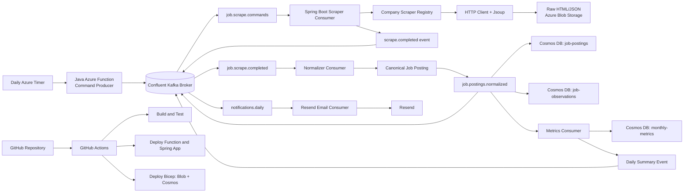

# Event-Driven Multi-Company Job Posting Scraper

## Goals

- Scrape job postings from multiple companies once per day.
- Measure job-title and job-level frequency by company and month.
- Use an existing Confluent Kafka broker as the event backbone.
- Preserve raw source data and normalized historical records.

The design uses Java Spring Boot, Azure Functions, Azure Blob Storage, Azure Cosmos DB for NoSQL, Resend, GitHub Actions, and an existing Confluent Kafka broker. It avoids browser automation and residential proxies.

The 2 pillars driving the architecture are:
1. This project is meant for learning purposes.
2. Keep costs to zero or minimal.

## Architecture overview



## Event-driven data flow

```text
Daily timer
  -> publish one scrape command per company
  -> scraper consumer fetches search and detail pages
  -> raw responses are written to Blob Storage
  -> scrape-completed event is published
  -> normalizer creates canonical job documents
  -> normalized events update Cosmos DB
  -> metrics consumer updates monthly aggregates
  -> daily summary event is published
  -> email consumer sends the Resend notification
```

The Kafka broker carries commands and facts. Blob Storage is the source-of-record for raw responses, while Cosmos DB stores queryable normalized data and metrics.

## Components

| Component | Responsibility |
|---|---|
| Azure Timer-triggered Function | Publishes daily scrape commands |
| Spring Boot Kafka consumers | Scraping, normalization, metrics, and notifications |
| Confluent Kafka | Durable event transport and replayable processing pipeline |
| Azure Blob Storage | Raw HTML, JSON responses, and run artifacts |
| Azure Cosmos DB for NoSQL | Current postings, observations, and monthly metrics |
| Resend | Daily scrape summary email |
| GitHub Actions | Build, test, and deployment automation |
| Bicep | Repeatable Azure infrastructure |

## Topic design

Use a clear event naming convention and keep commands separate from facts.

| Topic | Producer | Consumer | Key | Purpose |
|---|---|---|---|---|
| `job.scrape.commands` | Daily scheduler | Scraper workers | `companyId` | Requests one company scrape |
| `job.scrape.completed` | Scraper workers | Normalizer | `companyId` | Reports raw scrape completion and Blob locations |
| `job.postings.normalized` | Normalizer | Persistence and metrics consumers | `companyId:externalJobId` | Publishes canonical postings |
| `job.metrics.monthly` | Metrics consumer | Reporting and summary consumers | `companyId:yyyy-MM` | Publishes updated monthly counts |
| `notifications.daily` | Summary producer | Email consumer | `runId` | Requests the daily email |

Create a dead-letter topic for each processing topic, for example `job.scrape.commands.DLT`. Include retry headers or a retry-topic policy so temporary failures do not immediately become permanent failures.

Event envelope:

```json
{
  "eventId": "uuid",
  "eventType": "JobPostingNormalized",
  "eventVersion": 1,
  "occurredAt": "2026-08-15T10:00:00Z",
  "producer": "job-normalizer",
  "correlationId": "scrape-run-id",
  "companyId": "mckesson",
  "payload": {}
}
```

Use stable keys to preserve ordering per company or posting. Configure consumers with explicit consumer-group names so each logical stage receives each event once per group.

## Confluent Kafka topic reference

### Cluster

| Setting | Value |
|---|---|
| Cluster name | `shared-kafka-dev-us-central1` |
| Cloud provider / region | Azure / South Central US |
| Bootstrap server | `pkc-57jzz.southcentralus.azure.confluent.cloud:9092` |
| Security protocol | `SASL_SSL` |
| SASL mechanism | `PLAIN` |

### Topic creation settings (all topics)

Every topic was created with the following shared baseline. Increase partitions only when throughput or parallelism requires it.

| Setting | Value |
|---|---|
| Partitions | `1` |
| Cleanup policy | `Delete` |
| Retention time | `604800000 ms` (7 days) |
| Retention size | `-1` (unlimited by size) |
| Max message bytes | `1048576` (1 MB) |
| Replication factor | Cluster default |

### Primary topics

| Topic | Message key | Purpose |
|---|---|---|
| `job.scrape.commands` | `companyId` | Requests one company scrape per run |
| `job.scrape.completed` | `companyId` | Reports scrape completion and Blob paths |
| `job.postings.normalized` | `companyId:externalJobId` | Publishes canonical job posting events |
| `job.metrics.monthly` | `companyId:yyyy-MM` | Publishes updated monthly metric counts |
| `notifications.daily` | `runId` | Requests the daily summary email |

### Dead-letter topics (DLT)

Each primary topic has a corresponding DLT. Messages are routed to the DLT after all retry attempts are exhausted.

| DLT topic | Source topic | Message key |
|---|---|---|
| `job.scrape.commands.DLT` | `job.scrape.commands` | `companyId` (same as source) |
| `job.scrape.completed.DLT` | `job.scrape.completed` | `companyId` (same as source) |
| `job.postings.normalized.DLT` | `job.postings.normalized` | `companyId:externalJobId` (same as source) |
| `job.metrics.monthly.DLT` | `job.metrics.monthly` | `companyId:yyyy-MM` (same as source) |
| `notifications.daily.DLT` | `notifications.daily` | `runId` (same as source) |

### Standard event envelope

Every value message uses this common outer envelope. The `payload` field contains topic-specific data.

```json
{
  "eventId": "uuid",
  "eventType": "ScrapeCompanyCommand",
  "eventVersion": 1,
  "occurredAt": "2026-08-16T03:00:00Z",
  "producer": "job-scraper-function",
  "correlationId": "run-2026-08-16",
  "companyId": "mckesson",
  "payload": {}
}
```

### Data contracts (JSON Schema — Confluent Schema Registry)

Use **JSON Schema Draft 07** for all contracts. Schema context: `default`. Register each `-key` and `-value` subject separately under the topic's **Data contract** tab.

---

#### `job.scrape.commands-key`

```json
{
  "$schema": "http://json-schema.org/draft-07/schema#",
  "title": "JobScrapeCommandsKey",
  "description": "Kafka message key for job.scrape.commands; keyed by companyId to preserve per-company ordering.",
  "type": "string",
  "minLength": 1,
  "maxLength": 128,
  "pattern": "^[a-z0-9][a-z0-9-]*$",
  "examples": ["mckesson", "gm-financial", "lockheed-martin"]
}
```

#### `job.scrape.commands-value`

```json
{
  "$schema": "http://json-schema.org/draft-07/schema#",
  "title": "ScrapeCompanyCommandEnvelope",
  "description": "Event envelope for requesting one company scrape run.",
  "type": "object",
  "additionalProperties": false,
  "required": ["eventId","eventType","eventVersion","occurredAt","producer","correlationId","companyId","payload"],
  "properties": {
    "eventId": { "type": "string", "minLength": 1 },
    "eventType": { "type": "string", "const": "ScrapeCompanyCommand" },
    "eventVersion": { "type": "integer", "minimum": 1 },
    "occurredAt": { "type": "string", "format": "date-time" },
    "producer": { "type": "string", "minLength": 1 },
    "correlationId": { "type": "string", "minLength": 1 },
    "companyId": { "type": "string", "minLength": 1, "maxLength": 128, "pattern": "^[a-z0-9][a-z0-9-]*$" },
    "payload": {
      "type": "object",
      "additionalProperties": false,
      "required": ["runId","companyId","requestedAt","attempt"],
      "properties": {
        "runId": { "type": "string", "minLength": 1 },
        "companyId": { "type": "string", "minLength": 1, "maxLength": 128, "pattern": "^[a-z0-9][a-z0-9-]*$" },
        "requestedAt": { "type": "string", "format": "date-time" },
        "attempt": { "type": "integer", "minimum": 1 }
      }
    }
  }
}
```

---

#### `job.scrape.completed-key`

```json
{
  "$schema": "http://json-schema.org/draft-07/schema#",
  "title": "JobScrapeCompletedKey",
  "description": "Kafka message key for job.scrape.completed; keyed by companyId.",
  "type": "string",
  "minLength": 1,
  "maxLength": 128
}
```

#### `job.scrape.completed-value`

```json
{
  "$schema": "http://json-schema.org/draft-07/schema#",
  "title": "JobScrapeCompletedValue",
  "type": "object",
  "additionalProperties": false,
  "required": ["eventId","eventType","eventVersion","occurredAt","producer","correlationId","companyId","payload"],
  "properties": {
    "eventId": { "type": "string", "minLength": 1 },
    "eventType": { "type": "string", "const": "ScrapeCompletedEvent" },
    "eventVersion": { "type": "integer", "minimum": 1 },
    "occurredAt": { "type": "string", "format": "date-time" },
    "producer": { "type": "string", "minLength": 1 },
    "correlationId": { "type": "string", "minLength": 1 },
    "companyId": { "type": "string", "minLength": 1 },
    "payload": {
      "type": "object",
      "additionalProperties": false,
      "required": ["runId","companyId","startedAt","completedAt","searchPagesFetched","detailPagesFetched","blobPaths","errors"],
      "properties": {
        "runId": { "type": "string", "minLength": 1 },
        "companyId": { "type": "string", "minLength": 1 },
        "startedAt": { "type": "string", "format": "date-time" },
        "completedAt": { "type": "string", "format": "date-time" },
        "searchPagesFetched": { "type": "integer", "minimum": 0 },
        "detailPagesFetched": { "type": "integer", "minimum": 0 },
        "blobPaths": { "type": "array", "items": { "type": "string", "minLength": 1 } },
        "errors": { "type": "array", "items": { "type": "string" } }
      }
    }
  }
}
```

---

#### `job.postings.normalized-key`

```json
{
  "$schema": "http://json-schema.org/draft-07/schema#",
  "title": "JobPostingsNormalizedKey",
  "description": "Kafka message key for job.postings.normalized; format is companyId:externalJobId.",
  "type": "string",
  "pattern": "^[a-z0-9-]+:[^:]+$"
}
```

#### `job.postings.normalized-value`

```json
{
  "$schema": "http://json-schema.org/draft-07/schema#",
  "title": "JobPostingsNormalizedValue",
  "type": "object",
  "additionalProperties": false,
  "required": ["eventId","eventType","eventVersion","occurredAt","producer","correlationId","companyId","payload"],
  "properties": {
    "eventId": { "type": "string", "minLength": 1 },
    "eventType": { "type": "string", "const": "JobPostingNormalized" },
    "eventVersion": { "type": "integer", "minimum": 1 },
    "occurredAt": { "type": "string", "format": "date-time" },
    "producer": { "type": "string", "minLength": 1 },
    "correlationId": { "type": "string", "minLength": 1 },
    "companyId": { "type": "string", "minLength": 1 },
    "payload": {
      "type": "object",
      "additionalProperties": false,
      "required": ["id","companyId","externalJobId","titleRaw","titleNormalized","jobLevel","location","datePosted","firstSeenAt","lastSeenAt","isActive","contentHash","schemaVersion"],
      "properties": {
        "id": { "type": "string", "minLength": 1 },
        "companyId": { "type": "string", "minLength": 1 },
        "externalJobId": { "type": "string", "minLength": 1 },
        "titleRaw": { "type": "string", "minLength": 1 },
        "titleNormalized": { "type": "string", "minLength": 1 },
        "jobLevel": { "type": "string", "minLength": 1 },
        "location": { "type": "string", "minLength": 1 },
        "datePosted": { "type": "string", "format": "date" },
        "firstSeenAt": { "type": "string", "format": "date-time" },
        "lastSeenAt": { "type": "string", "format": "date-time" },
        "isActive": { "type": "boolean" },
        "contentHash": { "type": "string", "minLength": 1 },
        "schemaVersion": { "type": "integer", "minimum": 1 }
      }
    }
  }
}
```

---

#### `job.metrics.monthly-key`

```json
{
  "$schema": "http://json-schema.org/draft-07/schema#",
  "title": "JobMetricsMonthlyKey",
  "description": "Kafka message key for job.metrics.monthly; format is companyId:yyyy-MM.",
  "type": "string",
  "pattern": "^[a-z0-9-]+:[0-9]{4}-[0-9]{2}$"
}
```

#### `job.metrics.monthly-value`

```json
{
  "$schema": "http://json-schema.org/draft-07/schema#",
  "title": "JobMetricsMonthlyValue",
  "type": "object",
  "additionalProperties": false,
  "required": ["eventId","eventType","eventVersion","occurredAt","producer","correlationId","companyId","payload"],
  "properties": {
    "eventId": { "type": "string", "minLength": 1 },
    "eventType": { "type": "string", "const": "MonthlyMetricUpdated" },
    "eventVersion": { "type": "integer", "minimum": 1 },
    "occurredAt": { "type": "string", "format": "date-time" },
    "producer": { "type": "string", "minLength": 1 },
    "correlationId": { "type": "string", "minLength": 1 },
    "companyId": { "type": "string", "minLength": 1 },
    "payload": {
      "type": "object",
      "additionalProperties": false,
      "required": ["companyId","month","normalizedTitle","jobLevel","postingCount","uniquePostingCount","lastCalculatedAt"],
      "properties": {
        "companyId": { "type": "string", "minLength": 1 },
        "month": { "type": "string", "pattern": "^[0-9]{4}-[0-9]{2}$" },
        "normalizedTitle": { "type": "string", "minLength": 1 },
        "jobLevel": { "type": "string", "minLength": 1 },
        "postingCount": { "type": "integer", "minimum": 0 },
        "uniquePostingCount": { "type": "integer", "minimum": 0 },
        "lastCalculatedAt": { "type": "string", "format": "date-time" }
      }
    }
  }
}
```

---

#### `notifications.daily-key`

```json
{
  "$schema": "http://json-schema.org/draft-07/schema#",
  "title": "NotificationsDailyKey",
  "description": "Kafka message key for notifications.daily; keyed by runId.",
  "type": "string",
  "minLength": 1
}
```

#### `notifications.daily-value`

```json
{
  "$schema": "http://json-schema.org/draft-07/schema#",
  "title": "NotificationsDailyValue",
  "type": "object",
  "additionalProperties": false,
  "required": ["eventId","eventType","eventVersion","occurredAt","producer","correlationId","companyId","payload"],
  "properties": {
    "eventId": { "type": "string", "minLength": 1 },
    "eventType": { "type": "string", "const": "DailyNotificationRequested" },
    "eventVersion": { "type": "integer", "minimum": 1 },
    "occurredAt": { "type": "string", "format": "date-time" },
    "producer": { "type": "string", "minLength": 1 },
    "correlationId": { "type": "string", "minLength": 1 },
    "companyId": { "type": "string", "minLength": 1 },
    "payload": {
      "type": "object",
      "additionalProperties": false,
      "required": ["runId","summaryDate","companiesProcessed","newCount","changedCount","inactiveCount","failures"],
      "properties": {
        "runId": { "type": "string", "minLength": 1 },
        "summaryDate": { "type": "string", "format": "date" },
        "companiesProcessed": { "type": "integer", "minimum": 0 },
        "newCount": { "type": "integer", "minimum": 0 },
        "changedCount": { "type": "integer", "minimum": 0 },
        "inactiveCount": { "type": "integer", "minimum": 0 },
        "failures": { "type": "array", "items": { "type": "string" } }
      }
    }
  }
}
```

---

#### DLT contract pattern

All DLT topics share the same value schema structure. Only `originalTopic` differs per topic.

**`*.DLT-key`** — same key type as the source topic (see source topic key contract above).

**`*.DLT-value`** — envelope that wraps the original failed event alongside failure metadata:

```json
{
  "$schema": "http://json-schema.org/draft-07/schema#",
  "title": "DeadLetterEnvelope",
  "type": "object",
  "additionalProperties": false,
  "required": ["failedAt","consumerGroup","originalTopic","originalPartition","originalOffset","originalKey","retryCount","errorType","errorMessage","originalEvent"],
  "properties": {
    "failedAt": { "type": "string", "format": "date-time" },
    "consumerGroup": { "type": "string", "minLength": 1 },
    "originalTopic": {
      "type": "string",
      "enum": [
        "job.scrape.commands",
        "job.scrape.completed",
        "job.postings.normalized",
        "job.metrics.monthly",
        "notifications.daily"
      ]
    },
    "originalPartition": { "type": "integer", "minimum": 0 },
    "originalOffset": { "type": "integer", "minimum": 0 },
    "originalKey": { "type": "string", "minLength": 1 },
    "retryCount": { "type": "integer", "minimum": 0 },
    "errorType": { "type": "string", "minLength": 1 },
    "errorMessage": { "type": "string", "minLength": 1 },
    "originalEvent": { "type": "object" }
  }
}
```

For each DLT subject replace the `originalTopic` `enum` with a single `const` matching the source topic:

| DLT subject | `originalTopic` const value |
|---|---|
| `job.scrape.commands.DLT-value` | `"job.scrape.commands"` |
| `job.scrape.completed.DLT-value` | `"job.scrape.completed"` |
| `job.postings.normalized.DLT-value` | `"job.postings.normalized"` |
| `job.metrics.monthly.DLT-value` | `"job.metrics.monthly"` |
| `notifications.daily.DLT-value` | `"notifications.daily"` |

## Stages

### Stage 1 – Java Spring Boot Azure Function foundation

1. Create the Maven Java Azure Functions project.
2. Use Java 21 consistently in the local JDK, `pom.xml`, and Azure runtime configuration.
3. Add Spring Boot dependencies and initialize the Spring context once per function instance.
4. Keep the Azure Timer function thin; it should publish commands rather than scrape directly.
5. Add local configuration and environment-variable handling.
6. Add unit-test and fixture directories.

The Spring Boot application should expose separate services for the command producer, scraper consumer, normalizer, metrics consumer, and email consumer. Avoid a single class that performs every stage.

### Stage 2 – Kafka configuration and topics

1. Confirm the existing Confluent broker address, security protocol, SASL mechanism, username, and password or API key.
2. Store broker credentials in local environment variables or secret storage; never commit them.
3. Configure `bootstrap.servers`, `security.protocol`, `sasl.mechanism`, and the SASL credentials.
4. Create the topics listed above with an appropriate partition count and replication factor for the existing broker.
5. Create separate consumer groups for scraping, normalization, persistence, metrics, and email.
6. Configure `acks=all`, idempotent producers, retries, and delivery timeouts.
7. Configure consumer `enable.auto.commit=false` and commit offsets only after successful processing.
8. Configure retry and dead-letter handling.
9. Add a correlation ID and event ID to every message.
10. Test producing and consuming a sample `job.scrape.commands` event before adding the scraper.

For a small daily workload, start with one or a small number of partitions per topic. Increase partitions only when parallelism or throughput requires it. The key design requirement is that the key keeps related events ordered.

### Stage 3 – Event-driven scraping

**Status: IMPLEMENTED** (August 23, 2026)

1. ✅ The timer producer loads enabled companies from configuration. (Already implemented in Stage 1/2)
2. ✅ It publishes one `ScrapeCompanyCommand` per company to `job.scrape.commands`. (Already implemented in Stage 1/2)
3. ✅ The scraper consumer receives a command and selects the matching `CompanyScraper` implementation.
   - `CompanyScraper` interface in `scraper/api/CompanyScraper.java`
   - `CompanyScraperRegistry` in `scraper/registry/CompanyScraperRegistry.java` (no if/switch logic)
   - `ScrapeCommandHandler` in `application/command/ScrapeCommandHandler.java` (deserialization and routing)
4. ✅ The company scraper fetches search pages and job-detail pages using Java HTTP Client.
   - `JobSearchHttpClient` interface in `scraper/api/JobSearchHttpClient.java`
   - `JavaHttpJobSearchClient` in `infrastructure/http/JavaHttpJobSearchClient.java` (JDK built-in HttpClient)
   - `McKessonScraper` fetches real search-results pages (paginated) and job-detail pages from the
     live `careers.mckesson.com` site, verified working end-to-end on 2026-08-23 (see below).
   - Two safety caps prevent excessive live traffic to the real site on each run:
     `job-scraper.max-search-pages-per-run` (default `3`) and `job-scraper.max-detail-pages-per-run`
     (default `10`), plus a polite `job-scraper.request-delay` (default `PT0.3S`) between requests.
5. ✅ Jackson parses the JSON envelope and Jsoup parses the embedded HTML.
   - `McKessonSearchResponse` record models the real envelope shape: `{filters, results, hasJobs, hasContent}`,
     where `results` is itself an HTML fragment string (not nested JSON).
   - `McKessonSearchResultsParser` uses Jsoup to extract pagination metadata (`data-total-job-results`,
     `data-total-pages`, `data-current-page`, `data-records-per-page`) and one `McKessonJobSummary`
     (external job ID, raw title, location, raw date-posted, detail-page path) per search-result row.
   - `McKessonJobDetailParser` uses Jsoup to extract title/location from the job detail page's
     `section#ajd-header` element, as a cross-check against the search-results values.
6. ✅ Raw search responses and detail HTML are written to storage.
   - `RawScrapeStorage` interface in `infrastructure/blob/RawScrapeStorage.java`
   - `AzureBlobRawScrapeStorage` implementation (conditional when `azure.storage.enabled=true`)
   - `LocalFileRawScrapeStorage` implementation for local development and manual runs (conditional
     when `raw-storage.mode=file`) — see "Local file output" below.
   - `NoOpRawScrapeStorage` fallback when neither Blob nor file storage is selected
   - `BlobStorageConfiguration`/`BlobStorageProperties` and `RawStorageProperties` for Spring wiring
7. ✅ The consumer publishes `job.scrape.completed` with run ID, company ID, counts, errors, and Blob paths.
   - `ScrapeCompletedEvent` record
   - `ScrapeCompletedPublisher` interface
   - `KafkaScrapeCompletedPublisher` implementation (conditional when `kafka.enabled=true`)
   - `NoOpScrapeCompletedPublisher` for dev (conditional when `kafka.enabled=false`)
   - New `scrapeCompletedTopic` property in `KafkaProperties` (never hardcoded)
   - `ScrapeCommandHandler.handle(...)` invokes `ScrapeCompletedPublisher.publish(...)` with a
     `ScrapeCompletedEvent` built from the returned `ScrapeResult`, immediately after a successful
     scrape and before returning. This means the `ScraperConsumerFunction`'s Kafka offset for
     `job.scrape.commands` is only checkpointed after the downstream `job.scrape.completed` event
     has been successfully published — consistent with the "commit after success" guarantee
     documented under "Single Function App deployment" below. If publishing fails, the exception
     propagates and the offset is not committed, allowing redelivery. Verified with
     `ScrapeCommandHandlerTest#shouldPublishScrapeCompletedEventExactlyOnceOnSuccess`.
8. ⚠️ Failed work is retried and eventually sent to the dead-letter topic.
   - Automatic retry: uncaught exception from `handleScrapeCommand` propagates → no checkpoint → broker redelivery
   - Per-page and per-detail-page failures are caught and appended to `ScrapeResult.errors()` without
     aborting the rest of the run (partial-progress failure isolation)
   - Dead-letter production and backoff policy: **deferred to a future dedicated retry/DLT implementation stage**

### McKesson site reference (verified live 2026-08-23)

McKesson's careers site (`careers.mckesson.com`) is server-rendered HTML with no login or JavaScript
rendering required. Verified directly against the live site:

**Search-results AJAX endpoint:**

```
GET https://careers.mckesson.com/en/search-jobs/results
    ?ActiveFacetID=0&CurrentPage={n}&RecordsPerPage=15&Distance=50&RadiusUnitType=0
    &Keywords=&Location=&ShowRadius=False&IsPagination=True&FacetTerm=&FacetType=0
    &SearchResultsModuleName=Search+Results&SearchFilterModuleName=Search+Filter
    &SortCriteria=0&SortDirection=0&SearchType=5&PostalCode=
```

Returns a small JSON envelope: `{"filters":"...","results":"<html fragment>","hasJobs":true,"hasContent":true}`.
The `results` value is an HTML string containing:

```html
<section id="search-results" data-total-job-results="574" data-total-pages="39"
         data-current-page="1" data-records-per-page="15" ...>
  <ul>
    <li>
      <a class="search-results__job-title-link" href="/en/job/{slug}/{orgId}/{jobId}"
         data-job-id="{jobId}">{Title}</a>
      <span class="search-results__job-location">{Location}</span>
      <span class="search-results__job-date-posted">{MM/dd/yyyy}</span>
    </li>
  </ul>
</section>
```

`data-job-id` is the stable external ID used throughout the platform's deterministic Cosmos document IDs.

**Job detail page** (`https://careers.mckesson.com{detailPath}`):

```html
<section id="ajd-header" data-org-id="733" data-job-id="99563388640">
  <h2 class="job-description__job-title">Senior Director, Agentic Service Experience</h2>
  <span class="job-description__job-location">Fort Worth, Texas</span>
</section>
```

Fixtures reflecting this real shape are provided in `src/test/resources/fixtures/mckesson/`
(`search-results-page1.json`, `search-results-empty-page.json`, `job-detail-real.html`) for
deterministic parser testing.

### Local file output (pre-Blob/Cosmos)

Before Blob Storage and Cosmos DB are wired up for McKesson, raw scrape output and a structured
run summary can be written to the local filesystem instead, using the same path layout documented
for Blob Storage:

```text
{raw-storage.file-root-path}/{companyId}/{yyyy}/{MM}/{dd}/{runId}/search-page-{n}.json
{raw-storage.file-root-path}/{companyId}/{yyyy}/{MM}/{dd}/{runId}/job-{externalJobId}.html
{raw-storage.file-root-path}/{companyId}/{yyyy}/{MM}/{dd}/{runId}/run-summary.json
```

Enable it with `raw-storage.mode=file` (env var `RAW_STORAGE_MODE=file`) and, optionally,
`raw-storage.file-root-path` (env var `RAW_STORAGE_FILE_ROOT_PATH`, default `./output/raw`).
`LocalFileRawScrapeStorage` is the active `RawScrapeStorage` bean in this mode; `AzureBlobRawScrapeStorage`
and `NoOpRawScrapeStorage` remain unchanged and are simply not selected.

`run-summary.json` contains a structured `McKessonRunSummary`: run ID, company ID, timestamps, page/detail
counts, the full list of scraped jobs (external job ID, raw title, location, raw date-posted, detail path),
and any errors — this is the primary human-readable result of a scrape run before persistence exists.

To run a real scrape against the live McKesson site right now, without a live Kafka broker, Azure
Functions host, Blob Storage, or Cosmos DB, use the standalone `LocalMcKessonScrapeRunner`:

```powershell
mvn -q compile exec:java "-Dexec.mainClass=com.jobscraper.tools.LocalMcKessonScrapeRunner"
```

This constructs `McKessonScraper` directly (no Spring context) with `LocalFileRawScrapeStorage`
hardcoded to `raw-storage.mode=file`, runs one scrape, and prints a console summary. Output lands
under `./output/raw/mckesson/...` (gitignored). Wiring this scraper to real Azure Blob Storage and
Cosmos DB is a separate, later step.


### Stage 4 – Blob Storage and Cosmos DB

**Status: IMPLEMENTED** (August 22, 2026)

Blob layout:

```text
raw/{companyId}/{yyyy}/{MM}/{dd}/{runId}/search-page-1.json
raw/{companyId}/{yyyy}/{MM}/{dd}/{runId}/job-{externalJobId}.html
normalized/{companyId}/{yyyy}/{MM}/{dd}/{runId}/run-summary.json
```

✅ All three blob paths are implemented in `AzureBlobRawScrapeStorage` (`writeSearchPage`, `writeJobDetail`, `writeRunSummary`), with a `NoOpRawScrapeStorage` fallback for local dev.

Use one Cosmos database with three containers:

#### `job-postings`

One current normalized document per posting. The partition key: `/companyId`.

```json
{
  "id": "mckesson-99215825472",
  "companyId": "mckesson",
  "externalJobId": "99215825472",
  "titleRaw": "Lead Data Architect (Healthcare)",
  "titleNormalized": "Data Architect",
  "jobLevel": "Lead",
  "location": "Irving, TX",
  "datePosted": "2026-08-14",
  "firstSeenAt": "2026-08-15T10:00:00Z",
  "lastSeenAt": "2026-08-15T10:00:00Z",
  "isActive": true,
  "contentHash": "sha256:...",
  "schemaVersion": 1
}
```

✅ Modeled as `NormalizedJobPosting` in `domain/job/NormalizedJobPosting.java`, persisted idempotently via `CosmosJobPostingRepository` (`upsertItem` keyed by `/companyId` partition key).

#### `job-observations`

One document per posting observed per daily run. Store `companyId`, `jobId`, `observedAt`, `datePosted`, normalized title, job level, content hash, and scrape run ID.

✅ Modeled as `JobObservation` in `domain/job/JobObservation.java`, persisted via `CosmosJobObservationRepository`. **Known limitation:** the `job.postings.normalized` wire schema (per its JSON Schema contract, `additionalProperties: false`) does not carry the originating Kafka scrape `runId`, so `JobObservation.runId()` currently records a per-persistence-invocation UUID rather than the true upstream scrape run ID. See the class Javadoc for details.

#### `monthly-metrics`

Precomputed documents keyed by company, month, normalized title, and job level. The partition key: `/month`.

```json
{
  "id": "mckesson-2026-08-data-architect-lead",
  "companyId": "mckesson",
  "month": "2026-08",
  "normalizedTitle": "Data Architect",
  "jobLevel": "Lead",
  "postingCount": 4,
  "uniquePostingCount": 4
}
```

✅ `monthly-metrics` is now written in Stage 5 via `MonthlyMetricAggregationHandler` and `CosmosMonthlyMetricRepository`.

The persistence consumer should be idempotent. Use the event ID, company ID, and external job ID to prevent duplicate writes when Kafka redelivers an event.

✅ `PersistenceConsumerFunction` → `NormalizedPostingPersistenceHandler` upserts both `job-postings` and `job-observations` using deterministic IDs (`{companyId}:{externalJobId}` and `{companyId}:{scrapeDate}:{externalJobId}` respectively) before returning, so Kafka checkpointing only occurs after successful persistence.

**Design decision (Option A):** to make the persistence path testable end-to-end, Stage 4 also implements a minimal `NormalizerConsumerFunction` (`ScrapeCompletedNormalizationHandler`) that maps a `ScrapeCompletedEvent`'s detail-page blob paths into `NormalizedJobPosting` records and publishes them to `job.postings.normalized`. **Normalization in Stage 4 is passthrough only:** `titleNormalized` equals `titleRaw`, and `jobLevel` defaults to `"Unknown"`. Title/level derivation rules are implemented in Stage 5, per the README's own Stage 5 step list.

### Stage 5 - Monthly metrics

**Status: IMPLEMENTED** (August 23, 2026)

1. ✅ Consume `job.postings.normalized` in a dedicated metrics consumer group.
   - `MetricsConsumerFunction` delegates to `MonthlyMetricAggregationHandler`.
2. ✅ Counts bucket by `firstSeenAt` (not `datePosted`).
   - `MonthlyMetricAggregationHandler` derives `month` from `firstSeenAt` in UTC for stable aggregation.
3. ✅ Normalize titles consistently before aggregation.
   - `TitleNormalizer` applies shared normalization rules in `ScrapeCompletedNormalizationHandler` (normalizer stage), not in metrics.
4. ✅ Derive a job level using explicit rules and retain the raw title.
   - `JobLevelClassifier` applies ordered keyword matching; defaults to `Mid-Level` when no keyword matches.
5. ✅ Upsert a monthly metric document using company, month, title, and level.
   - `MonthlyMetric` documents are persisted via `MonthlyMetricRepository` (`CosmosMonthlyMetricRepository`) with partition key `/month`.
   - Idempotency is proven with `observedJobDates` set semantics using deterministic keys: `{externalJobId}:{scrapeDate}`.
6. ✅ Publish a `job.metrics.monthly` event after successful updates.
   - `KafkaMonthlyMetricPublisher` publishes `MonthlyMetricPublishedEvent` keyed by `companyId:yyyy-MM`.
7. ✅ Rebuild a month from `job-observations` when normalization rules change.
   - `MonthlyMetricRebuildService` is implemented as an internal service operation (no Function trigger), intentionally preserving the fixed six-function topology.

**Architecture note:** title/job-level rule ownership remains in the Normalizer boundary, while Metrics strictly aggregates normalized fields and publishes monthly updates. This avoids duplicated rule logic across stages.

### Stage 6 – Daily email with Resend

**Status: IMPLEMENTED** (September 9, 2026)

1. ✅ Consume completed scrape and metrics events.
   - `ScrapeCompletedNormalizationHandler` (Normalizer) registers each company's expected posting
     count with `RunCompletionAggregator` immediately after publishing `job.postings.normalized`
     events for a `job.scrape.completed` message.
   - `NormalizedPostingPersistenceHandler` (Persistence) classifies each upserted posting as
     `PersistenceOutcome.NEW`, `UPDATED`, or `UNCHANGED` (by comparing against any prior
     document's `contentHash` via the new `JobPostingRepository.findById`) and reports it to
     `RunCompletionAggregator`.
2. ✅ Build a daily summary containing companies processed, new postings, changed postings,
   inactive postings, and failures.
   - `RunCompletionAggregator` / `InMemoryRunCompletionAggregator` accumulate new/changed counts
     per company until every expected posting has been recorded, then build a
     `DailyNotificationRequestedEvent`.
   - **Scope decisions (documented, not deferred silently):**
     - **Per-company, not per-run:** aggregation is keyed by `companyId`, not `runId`, because the
       registered `job.postings.normalized` JSON Schema (`additionalProperties: false`) does not
       carry the originating scrape `runId` — the same constraint already documented on
       `JobObservation` in Stage 4. One daily notification is published per completed company
       scrape rather than batched across every company in a shared cron run. This mirrors the
       architecture's existing "one message per company" philosophy (see "Parallel scraping and
       failure isolation" below) and avoids fragile cross-company synchronization. Multi-company
       batching into a single combined email is a natural Stage 7/8 enhancement once a durable
       run registry exists.
     - **`inactiveCount` is always `0`:** detecting postings that disappeared from a scrape (no
       longer listed) requires a reconciliation step against previously-active postings that is
       not yet implemented.
     - **Top titles / top job levels are intentionally omitted** from the wire event to preserve
       compatibility with the already-registered `notifications.daily-value` JSON Schema
       (`additionalProperties: false`, and these fields are not declared in it). This data remains
       queryable from the `monthly-metrics` Cosmos container for future dashboard/reporting use.
3. ✅ Publish a `notifications.daily` event with a unique run ID.
   - `DailyNotificationPublisher` interface, `KafkaDailyNotificationPublisher` (conditional on
     `kafka.enabled=true`), `NoOpDailyNotificationPublisher` (dev fallback). Keyed by `runId`,
     matching the topic design table above.
4. ✅ Consume that event in a dedicated email consumer group.
   - `ResendEmailConsumerFunction` (Kafka trigger on `%KAFKA_NOTIFICATIONS_DAILY_TOPIC%`,
     consumer group `%KAFKA_EMAIL_CONSUMER_GROUP%`) → `DailyNotificationHandler`.
5. ✅ Send the message with the official Resend Java SDK.
   - `ResendDailyNotificationSender` (conditional on `resend.enabled=true`) builds a
     `CreateEmailOptions` payload via the `com.resend.services.emails.model` API and posts it
     through the official `Resend` Java client. `LoggingDailyNotificationSender` is the dev
     fallback (`resend.enabled=false` or unset).
6. ✅ Store the API key as an Azure Function or Spring application setting.
   - `ResendProperties` (`resend.apiKey`, env var `RESEND_API_KEY`) and
     `ResendConfiguration` construct the `Resend` client bean; the key is never hardcoded or
     logged.
7. ✅ Retry temporary failures and prevent duplicate emails for the same run ID.
   - Retry: an uncaught exception from `DailyNotificationHandler.handle(...)` (e.g. a
     `ResendException` thrown by the SDK) propagates out of `ResendEmailConsumerFunction.run(...)`,
     so the Kafka offset is not committed and the message is redelivered — the same "commit after
     success" pattern used throughout the pipeline.
   - Duplicate prevention: `SentNotificationGuard` / `InMemorySentNotificationGuard` record a
     `runId` as sent only after `DailyNotificationSender.send(...)` succeeds; a redelivered
     message for an already-sent `runId` is skipped without a second Resend call. This directly
     addresses the exact redelivery scenario observed firsthand during this project's local
     testing (a consumer process interrupted after a successful send but before offset commit).
     **Known limitation:** this guard's state lives only in process heap and does not survive a
     host restart or span multiple Function App instances; a durable (Cosmos-backed) guard is a
     natural Stage 7/8 hardening item, consistent with `InMemoryRunCompletionAggregator`'s
     documented limitation above.

Resend's free tier (100 emails/day, 3,000/month, sending only to the account owner's address
until a custom domain is verified) should be treated as a development allowance, not a permanent
production-scale free tier.

### Stage 7 – Infrastructure as Code for Azure and Confluent

**Status: IMPLEMENTED** (September 9, 2026). Bicep templates, Terraform modules, and a
validation-only GitHub Actions workflow are in place under `infra/` and
`.github/workflows/infra-validate.yml`. See `docs/STAGE7_PLAN.md` for the detailed plan this
implementation follows, and `infra/azure/README.md` / `infra/confluent/README.md` for runbooks.
**Nothing has been applied against real Azure/Confluent resources yet** — that is a deliberate,
manual step gated behind the runbooks (in particular the Confluent topic import), and full
automated apply/deploy remains Stage 8, which is explicitly not started.

1. ✅ Bicep templates for Azure infrastructure.
   - `infra/azure/main.bicep` orchestrates `modules/storage.bicep`, `modules/cosmos.bicep`,
     `modules/keyvault.bicep`, `modules/monitoring.bicep`, and `modules/function-app.bicep`.
   - All 30+ app settings from `local.settings.sample.json` are wired 1:1 as Function App
     settings; the 6 secret-bearing ones (`AzureWebJobsStorage`, `KAFKA_USERNAME`,
     `KAFKA_PASSWORD`, `AZURE_STORAGE_CONNECTION_STRING`, `AZURE_COSMOS_KEY`, `RESEND_API_KEY`)
     are Key Vault references, not plain values.
   - `parameters.dev.json` / `parameters.prod.json` provide per-environment values.
2. ✅ Terraform modules for Confluent resources.
   - `infra/confluent/main.tf` manages the existing `shared-kafka-dev-us-central1` cluster's 5
     primary topics + 5 DLTs (as a `for_each` against the README's own baseline table), 5
     per-role service accounts (`modules/service-accounts`), and least-privilege ACLs
     (`modules/acls`) — the cluster and environment themselves are `data` sources, never created.
3. ✅ Validation-only GitHub Actions workflow.
   - `.github/workflows/infra-validate.yml` runs `az bicep build` + `az deployment group
     what-if` and `terraform fmt -check` + `terraform validate` (+ optional `terraform plan`) on
     every pull request touching `infra/**`. It intentionally has no `apply`/deploy/approval-gate
     step — that is Stage 8.

**Scope decisions (documented, not deferred silently):**
- **Per-consumer-group Confluent service accounts are provisioned in Terraform but not yet wired
  into the app:** `KafkaProperties` currently exposes a single shared `username`/`password` used
  by every producer and consumer in this one Function App. The 5 service accounts (scraper,
  normalizer, persistence, metrics, email) and their ACLs are real, least-privilege groundwork,
  but adopting them in the running app requires a follow-up Java change (multiple
  `ConsumerFactory`/`ProducerFactory` beans) that is out of scope for Stage 7.
- **`notifications.daily` write ACL is granted to the `persistence` service account, not
  `email`:** `NormalizedPostingPersistenceHandler` (Persistence), not the email consumer, is the
  actual caller of `DailyNotificationPublisher` via `RunCompletionAggregator` — the `email`
  service account is read-only, matching its real role as a consumer.
- **Cosmos/Storage secrets flow through Key Vault references but keep key/connection-string
  auth:** `CosmosProperties.key` and `BlobStorageProperties.connectionString` remain the
  credential shape the app reads; Key Vault only changes *where the value is stored*, not *how*
  the app authenticates. Switching to managed identity/RBAC is a Stage 7+ hardening follow-up.
- **Existing Confluent topics require a one-time `terraform import`:** all 5 primary topics and
  their 5 DLTs were created manually against the shared `shared-kafka-dev-us-central1` cluster
  (see "Confluent Kafka topic reference" above) — the first `terraform apply` must import them,
  not create them, or it will fail on already-existing resources. See
  `infra/confluent/README.md` for the exact import commands.
- **Key Vault role assignment lives in `main.bicep`, not `keyvault.bicep`:** avoids a circular
  module dependency between the Key Vault module (needs the Function App's managed identity) and
  the Function App module (needs the Key Vault's URI for its secret references). See
  `infra/azure/README.md` for the full explanation.
- **Cosmos DB is provisioned in free-tier mode (`enableFreeTier: true`, shared database-level
  throughput of 1,000 RU/s), not serverless:** capacity analysis for up to 10 companies polling
  daily shows a realistic burst demand of ~330 RU/s — comfortably under the free 1,000 RU/s
  ceiling — so Cosmos DB costs **$0/month** at this project's projected scale. Note "1,000 RU/s"
  is a continuously reserved throughput *rate*, not a monthly quota (it does not reset monthly,
  unlike the Function App's execution grant). Since serverless and provisioned throughput cannot
  be converted after account creation, this decision was made before any real deployment exists.
  See `infra/azure/README.md`'s "Cosmos DB: free tier capacity analysis" section for the full
  derivation and the one-per-subscription free-tier constraint.
- **No other provisioned resource here is unconditionally free** — Storage and Key Vault are
  billed per-use (though at negligible cost, ~$0.10–$1/month combined), while Function App compute
  and Log Analytics ingestion stay at $0/month thanks to their own monthly free grants. Estimated
  total: **~$0.10–$1.10/month**. See `infra/azure/README.md`'s "Estimated Azure costs" section for
  the full per-resource breakdown.

Use a hybrid infrastructure automation approach:
- **Bicep** manages Azure-native resources.
- **Terraform** manages Confluent Kafka resources.
- **GitHub Actions** orchestrates validation, planning, approval, deployment, and smoke tests.

**Bicep (Azure resources):**
1. Create `infra/azure/main.bicep` with modules for Function App, Storage, Cosmos DB, Key Vault, and monitoring.
2. Parameterize resource names, locations, SKUs, and environment-specific settings.
3. Use managed identities for inter-resource and Azure-to-Confluent authentication.
4. Outputs should expose connection strings, endpoint URIs, and identity details for app settings wiring.

**Terraform (Confluent Kafka resources):**
1. Create `infra/confluent/main.tf` to manage the Confluent broker, topics, service accounts, API keys, and ACLs.
2. Parameterize cluster details, topic partition counts, replication factors, and retention policies.
3. Use Terraform Cloud or Azure Storage backend for remote state.
4. Create separate service accounts for scraper, normalizer, metrics, and email consumers.
5. Apply fine-grained ACLs so each consumer group has read access only to its required topics.

**GitHub Actions CI/CD pipeline (Stage 7 implements items 1–3 only; items 4–8 are Stage 8, not started):**
1. Validate Bicep syntax and Terraform format on every pull request.
2. Run `terraform plan` and capture Confluent resource diffs.
3. Run `az bicep build` or `what-if` to preview Azure changes.
4. Require manual approval before applying infrastructure changes to production.
5. Apply Bicep to deploy Azure resources.
6. Apply Terraform to create/update Confluent resources.
7. Deploy the Java Function App artifact and update app settings.
8. Run a smoke test that publishes a test scrape command and verifies the expected event path.

**Repository layout (as implemented):**
```
infra/
  azure/
    main.bicep
    parameters.dev.json
    parameters.prod.json
    README.md
    modules/
      function-app.bicep
      storage.bicep
      cosmos.bicep
      keyvault.bicep
      monitoring.bicep
  confluent/
    main.tf
    variables.tf
    outputs.tf
    backend.tf
    terraform.tfvars.example
    README.md
    modules/
      topics/
      service-accounts/
      acls/
.github/
  workflows/
    infra-validate.yml   # validate/plan only — Stage 8 adds the apply/deploy/smoke-test workflow
docs/
  STAGE7_PLAN.md
```

**Key practices:**
- Store Confluent API credentials in GitHub Secrets, never in Terraform files.
- Use Azure Key Vault to store Kafka credentials at runtime; inject them into Function App settings during deployment.
- Keep infrastructure state remote (Terraform Cloud or Azure Storage backend).
- Version both Bicep and Terraform templates in Git.
- Run infrastructure and app deployment as separate steps so app releases do not depend on infrastructure changes.

### Stage 8 – GitHub Actions CI/CD for application and infrastructure deployment

**Status: IMPLEMENTED** (September 9, 2026). See `docs/STAGE8_PLAN.md` for the detailed plan this
implementation follows (including ground-truth constraints inherited from Stage 7), and
`.github/workflows/README.md` for the **required, one-time, manual repository configuration**
(GitHub Environments, Secrets, Variables) needed before any of this can actually run — none of
that is expressible as a committed file. All three workflow files pass `actionlint` (GitHub
Actions expression/dependency-graph validation, including embedded `shellcheck` linting of every
`run:` block) with zero issues.

Pipeline:

```
validate
  -> unit-tests
  -> package
  -> plan-azure
  -> plan-confluent
  -> approval-gate
  -> apply-azure
  -> apply-confluent
  -> deploy-app
  -> smoke-test-kafka
```

1. ✅ Build and test the Maven project on pull requests. — `.github/workflows/deploy.yml`'s
   `unit-tests` job (`mvn test`).
2. ✅ Validate topic names, consumer groups, and configuration templates. — `validate` job's
   `scripts/validate_kafka_config.py` step, plus `az bicep build`/`terraform validate`.
3. ✅ Build the Azure Functions and Spring Boot artifacts. — `package` job (`mvn clean package`),
   uploaded as a build artifact so `deploy-app` deploys exactly what was tested.
4. ✅ Run `terraform plan` for Confluent resources. — `plan-confluent` job, against the real
   remote state backend, saved as an artifact for `apply-confluent` to reuse verbatim.
5. ✅ Run Bicep `build` or `what-if` for Azure resources. — `plan-azure` job.
6. ✅ Require manual approval before deployment to production. — GitHub's native Environment
   protection rules on `environment: production` (required reviewers), which the
   `apply-azure`/`apply-confluent`/`deploy-app`/`smoke-test-kafka` jobs all target. Configuring the
   reviewer is a one-time manual repository setting — see `.github/workflows/README.md`.
7. ✅ Deploy Bicep for the Function App, Storage, Cosmos DB, Key Vault, and monitoring. —
   `apply-azure` job (`az deployment group create`).
8. ✅ Deploy Terraform for Kafka topics, service accounts, and ACLs. — `apply-confluent` job,
   applying the exact plan saved by `plan-confluent` (no re-plan/re-approve drift).
9. ✅ Deploy application code after infrastructure succeeds; update app settings and wired
   secrets. — `deploy-app` job, gated on both `apply-azure` and `apply-confluent` via `needs:`.
10. ✅ Store Kafka, Cosmos, and Resend secrets in GitHub Secrets and Azure Key Vault, never in
    code. — `deploy-app` syncs `KAFKA_CLIENT_API_KEY`/`KAFKA_CLIENT_API_SECRET`/`RESEND_API_KEY`
    GitHub Secrets into the Key Vault secrets Stage 7 created with empty placeholders, closing
    that forward-reference. Cosmos's key is already populated directly from the Cosmos module's
    own output (Stage 7), never a GitHub Secret.
11. ✅ Restrict production deployment to the main branch. — enforced **structurally**, not just by
    convention: the `setup` job's `should_apply` output is only `true` for the `production`
    environment when `github.ref == 'refs/heads/main'`, regardless of trigger type (push or manual
    `workflow_dispatch`).
12. ✅ Run a smoke test that publishes a test command and verifies the expected event path. —
    `smoke-test-kafka` job runs `scripts/smoke_test.sh`: triggers a real on-demand scrape via the
    deployed `OnDemandScrapeCommandProducer` HTTP endpoint, then polls Application Insights for
    the `Scrape completed for company ...` trace within a timeout.
13. ✅ Add a manual replay workflow for a selected company and date range. —
    `.github/workflows/replay.yml` (`workflow_dispatch`). See the scope decision below regarding
    the `from_date`/`to_date` inputs.

**Scope decisions (documented, not deferred silently):**
- **`pom.xml` is not edited to hardcode an environment-specific Function App name.** Bicep names
  the Function App `job-scraper-function-dev`/`job-scraper-function-prod` (Stage 7), which
  differs from `pom.xml`'s literal `<functionAppName>job-scraper-function-20260815154131779</functionAppName>`
  default. `deploy-app` overrides this per environment with
  `-DfunctionAppName=job-scraper-function-<env>` on the Maven command line (a plain
  `<properties>` entry is overridable via `-D`) rather than baking an environment into source.
- **`deploy-app` reuses the existing `azure-functions-maven-plugin` `deploy` goal** (a
  provision-and-deploy upsert) instead of a hand-rolled `az functionapp deploy` zip-based path.
  Safe against the already Bicep-provisioned app today (idempotent; only merges the one
  `FUNCTIONS_EXTENSION_VERSION` setting declared in `pom.xml`) but is a real coupling worth
  monitoring if the plugin's assumptions ever drift from Bicep's resource shape.
- **The replay workflow re-triggers a live on-demand scrape, not historical reprocessing.**
  `MonthlyMetricRebuildService` (Stage 5) exists specifically for rebuilding a month from
  `job-observations` after a normalization rule change, but has **no Function trigger** by
  deliberate design (preserving the fixed function topology documented in Stage 5). Wiring a true
  "date range" replay would require adding a new trigger, contradicting that decision.
  `replay.yml` accepts `from_date`/`to_date` inputs for forward compatibility and emits an
  explicit `::warning::` if they're supplied, rather than silently ignoring them or secretly
  adding an undiscussed 8th Function trigger.
- **The smoke test hits the real, live company careers site**, mirroring the exact manual
  verification already performed by hand during Stage 6. Acceptable at this project's scale
  (single company, request-delay throttling, single-partition topics); worth reconsidering if
  company count/frequency grows enough to raise scraping-etiquette or rate-limit concerns.
- **`apply-confluent` assumes the one-time `terraform import` runbook has already run manually**
  (per `infra/confluent/README.md`) — the pipeline does not attempt to auto-detect and self-heal
  an un-imported state, to avoid silently creating duplicate topics if that pre-flight were
  skipped.

## Updated the implementation order

1. Create and build the Maven Azure Functions project.
2. Add Spring Boot application structure.
3. Configure the existing Confluent broker and create Kafka topics.
4. Publish and consume a test scrape command.
5. Implement the McKesson scraper consumer.
6. Add Blob Storage raw persistence.
7. Add normalization and Cosmos DB persistence.
8. Add multiple company configurations.
9. Add monthly metrics.
10. Add daily Resend summaries.
11. Create Bicep templates for Azure infrastructure (Stage 7).
12. Create Terraform modules for Confluent resources (Stage 7).
13. Build GitHub Actions CI/CD pipeline (Stage 8).

## Single Function App deployment

Use one Flex Consumption Function App containing seven independently triggered functions:

```text
job-scraper-function
|- DailyScrapeCommandProducer       Timer trigger
|- OnDemandScrapeCommandProducer    HTTP trigger (AuthorizationLevel.FUNCTION)
|- ScraperConsumer                  Kafka trigger
|- NormalizerConsumer               Kafka trigger
|- PersistenceConsumer              Kafka trigger
|- MetricsConsumer                  Kafka trigger
`- ResendEmailConsumer               Kafka trigger
```

The Function App is the deployment boundary. Kafka topics, consumer groups, partitions, retries, and dead-letter topics provide the event-driven behavior.

`DailyScrapeCommandProducer` and `OnDemandScrapeCommandProducer` both delegate to the same `DailyScrapeCommandProducer` application service (`application/command/DailyScrapeCommandProducer.java`) and publish the identical `ScrapeCompanyCommand` shape to `job.scrape.commands`, so downstream consumers cannot distinguish — and do not need to distinguish — between a cron-triggered run and an on-demand run. See "Triggering a scrape: cron vs. on demand" under local workstation setup for usage details.

Persistence stays in a dedicated `PersistenceConsumerFunction`. It consumes `job.postings.normalized` and is the sole persistence boundary for Cosmos DB writes. `NormalizerConsumerFunction` is responsible for canonicalization and downstream event publication only, not durable Cosmos writes.

Azure `KafkaTrigger` checkpointing occurs only after successful execution: the extension commits the consumed offset only after a function's `run` method returns without throwing. If the handler throws, the offset is not committed and the message is redelivered.

Testcontainers-based integration tests (`KafkaScrapeCompletedPublisherTest`, `KafkaNormalizedPostingPublisherTest`, `KafkaMonthlyMetricPublisherTest`, `AzureBlobRawScrapeStorageTest`) are tagged `@Tag("integration")` and excluded from the default `mvn test` run via the `maven-surefire-plugin`'s `excludedGroups` configuration, since they require a running Docker daemon. Run them explicitly with `mvn test -Dgroups=integration` in an environment with Docker available.

This is a serverless, event-driven modular platform with microservice-style bounded components. It should not be described as independently deployable microservices unless the components are later split into separate Function Apps.

## Architecture guarantees

### Job deduplication

Kafka processing must be treated as at-least-once delivery. Consumers must be idempotent.

Use deterministic identifiers:

```text
Current posting ID:
  {companyId}:{externalJobId}

Observation ID:
  {companyId}:{scrapeDate}:{externalJobId}

Scrape command ID:
  {runId}:{companyId}
```

The job-postings Cosmos document uses the company ID and external job ID as its stable identity:

```json
{
  "id": "mckesson:99215825472",
  "companyId": "mckesson",
  "externalJobId": "99215825472"
}
```

The persistence consumer uses upsert operations. Replayed events update the existing document rather than creating duplicates. Daily observation documents use a deterministic ID so the same posting is recorded only once per company and scrape date. Monthly metrics are upserted or recalculated from unique observations rather than blindly incremented for every Kafka delivery.

Consumer processing order:

```text
Receive Kafka event
  -> validate event
  -> perform deterministic persistence
  -> publish downstream event
  -> commit Kafka offset
```

Offsets must not be committed before successful persistence.

### Parallel scraping and failure isolation

Publish one ScrapeCompanyCommand per company. Never publish one message containing the complete company list.

```text
job.scrape.commands

ScrapeCompany(USAA)
ScrapeCompany(GM Financial)
ScrapeCompany(BNSF)
ScrapeCompany(Oracle)
ScrapeCompany(Microsoft)
ScrapeCompany(Amazon)
ScrapeCompany(Google)
ScrapeCompany(Lockheed Martin)
ScrapeCompany(Forescout)
ScrapeCompany(Indeed)
```

Use companyId as the Kafka message key. Kafka routes records with the same key to the same partition, preserving ordering for that key. Multiple partitions allow the scraper consumer group to process different companies concurrently.

Use one-message processing for the scraper command topic initially. This ensures a failure for Oracle does not cause a batch containing successful USAA, GM Financial, or BNSF commands to be retried as one unit.

Expected behavior:

```text
USAA       -> SUCCESS -> commit offset
GM         -> SUCCESS -> commit offset
BNSF       -> SUCCESS -> commit offset
Oracle     -> FAILURE -> retry Oracle only
Microsoft  -> SUCCESS -> commit offset
```

Each scraper should have its own timeout, retry limit, backoff policy, rate limit, circuit breaker, failure status, and dead-letter handling.

After the retry limit is exceeded:

`text
ScrapeCompany(Oracle)
  -> retry with backoff
  -> job.scrape.commands.DLT
  -> ScrapeCompanyFailed event
`

A failed company must not prevent other company commands from completing.

### Pluggable scraper implementations

Use a common scraper contract and registry:

```java
public interface CompanyScraper {
    CompanyId companyId();
    ScrapeResult scrape(ScrapeContext context);
}
```

Each company implements the contract independently:

```text
CompanyScraper
|- UsaaScraper
|- GmFinancialScraper
|- BnsfScraper
|- OracleScraper
|- MicrosoftScraper
|- AmazonScraper
|- GoogleScraper
|- LockheedMartinScraper
|- ForescoutScraper
`- IndeedScraper
```

The Kafka consumer selects a scraper through CompanyScraperRegistry. It must not contain company-specific if or switch statements.

Adding a company should require:

```text
Add NewCompanyScraper
Add parser tests
Add saved response fixtures
Add company configuration
No changes to Kafka consumer
No changes to persistence
No changes to metrics
```

## Code structure

Use a modular hexagonal structure so the single Function App can later be split into multiple deployable services without rewriting business logic:

`text
src/main/java/com/jobscraper/
|- function/
|   |- DailyScrapeCommandProducerFunction.java
|   |- OnDemandScrapeCommandProducerFunction.java
|   |- ScraperConsumerFunction.java
|   |- NormalizerConsumerFunction.java
|   |- PersistenceConsumerFunction.java
|   |- MetricsConsumerFunction.java
|   `- ResendEmailConsumerFunction.java
|- application/
|   |- command/
|   |   |- DailyScrapeCommandProducer.java
|   |   |- ScrapeCommandPublisher.java
|   |   |- KafkaScrapeCommandPublisher.java
|   |   |- NoOpScrapeCommandPublisher.java
|   |   |- ScrapeCompanyCommand.java
|   |   |- ScrapeCommandHandler.java
|   |   |- ScrapeCompletedEvent.java
|   |   |- ScrapeCompletedPublisher.java
|   |   |- KafkaScrapeCompletedPublisher.java
|   |   `- NoOpScrapeCompletedPublisher.java
|   |- normalization/
|   |   |- NormalizedPostingPublisher.java
|   |   |- KafkaNormalizedPostingPublisher.java
|   |   |- NoOpNormalizedPostingPublisher.java
|   |   `- ScrapeCompletedNormalizationHandler.java
|   |- persistence/
|   |   |- NormalizedPostingPersistenceHandler.java
|   |   `- PersistenceOutcome.java
|   |- metrics/
|   |   |- MonthlyMetricPublishedEvent.java
|   |   |- MonthlyMetricPublisher.java
|   |   |- KafkaMonthlyMetricPublisher.java
|   |   |- NoOpMonthlyMetricPublisher.java
|   |   |- MonthlyMetricAggregationHandler.java
|   |   `- MonthlyMetricRebuildService.java
|   `- notification/
|       |- DailyNotificationRequestedEvent.java
|       |- DailyNotificationHandler.java
|       |- DailyNotificationSender.java
|       |- LoggingDailyNotificationSender.java
|       |- ResendDailyNotificationSender.java
|       |- DailyNotificationPublisher.java
|       |- KafkaDailyNotificationPublisher.java
|       |- NoOpDailyNotificationPublisher.java
|       |- RunCompletionAggregator.java
|       |- InMemoryRunCompletionAggregator.java
|       |- SentNotificationGuard.java
|       `- InMemorySentNotificationGuard.java
|- domain/
|   |- company/
|   |- job/
|   |   |- NormalizedJobPosting.java
|   |   |- JobObservation.java
|   |   |- ContentHasher.java
|   |   |- JobLevelKeywords.java
|   |   |- JobLevelClassifier.java
|   |   |- TitleNormalizer.java
|   |   `- JobObservation.java
|   |- events/
|   `- metrics/
|       `- MonthlyMetric.java
 |- scraper/
|   |- api/
|   |   |- CompanyScraper.java
|   |   |- ScrapeContext.java
|   |   |- ScrapeResult.java
|   |   `- JobSearchHttpClient.java
|   |- registry/
|   |   `- CompanyScraperRegistry.java
|   `- companies/
|       |- mckesson/
|       |   |- McKessonScraper.java
|       |   |- McKessonSearchResponse.java
|       |   |- McKessonSearchResultsParser.java
|       |   |- McKessonSearchPage.java
|       |   |- McKessonJobSummary.java
|       |   |- McKessonJobDetailParser.java
|       |   `- McKessonRunSummary.java
|       |- usaa/
|       |- gmfinancial/
|       |- bnsf/
|       |- oracle/
|       |- microsoft/
|       |- amazon/
|       |- google/
|       |- lockheedmartin/
|       |- forescout/
|       `- indeed/
|- infrastructure/
|   |- kafka/
|   |   `- KafkaPublisherConfiguration.java
|   |- http/
|   |   `- JavaHttpJobSearchClient.java
|   |- blob/
|   |   |- RawScrapeStorage.java
|   |   |- AzureBlobRawScrapeStorage.java
|   |   |- NoOpRawScrapeStorage.java
|   |   |- NotFileRawStorageModeCondition.java
|   |   `- BlobStorageConfiguration.java
|   |- file/
|   |   `- LocalFileRawScrapeStorage.java
|   |- cosmos/
|   |   |- JobPostingRepository.java
|   |   |- JobObservationRepository.java
|   |   |- MonthlyMetricRepository.java
|   |   |- CosmosJobPostingRepository.java
|   |   |- CosmosJobObservationRepository.java
|   |   |- CosmosMonthlyMetricRepository.java
|   |   |- NoOpJobPostingRepository.java
|   |   |- NoOpJobObservationRepository.java
|   |   |- NoOpMonthlyMetricRepository.java
|   |   `- CosmosConfiguration.java
|   |- email/
|   `- observability/
`- configuration/
    |- KafkaProperties.java
    |- JobScraperProperties.java
    |- BlobStorageProperties.java
    |- RawStorageProperties.java
    |- ResendProperties.java
    `- CosmosProperties.java
`

Tests should mirror the company adapters and application handlers:

`text
src/test/java/com/jobscraper/
|- scraper/
|   |- companies/
|   |   `- mckesson/
|   |       `- McKessonScraperTest.java
|   `- api/
|- application/
|   |- command/
|   |   |- ScrapeCommandHandlerTest.java
|   |   `- KafkaScrapeCompletedPublisherTest.java
|   |- metrics/
|   |   |- MonthlyMetricAggregationHandlerTest.java
|   |   |- MonthlyMetricRebuildServiceTest.java
|   |   `- KafkaMonthlyMetricPublisherTest.java
|   |- normalization/
|   |   |- ScrapeCompletedNormalizationHandlerTest.java
|   |   `- KafkaNormalizedPostingPublisherTest.java
|   |- persistence/
|   |   `- NormalizedPostingPersistenceHandlerTest.java
|   `- [other packages]/
|- domain/
|   `- job/
|       |- NormalizedJobPostingTest.java
|       |- JobObservationTest.java
|       |- ContentHasherTest.java
|       |- JobLevelClassifierTest.java
|       `- TitleNormalizerTest.java
|   `- metrics/
|       `- MonthlyMetricTest.java
 |- infrastructure/
|   |- http/
|   |   `- JavaHttpJobSearchClientTest.java
|   |- kafka/
|   |- blob/
|   |   `- AzureBlobRawScrapeStorageTest.java
|   `- cosmos/
|       |- CosmosJobPostingRepositoryTest.java
|       |- CosmosJobObservationRepositoryTest.java
|       |- CosmosMonthlyMetricRepositoryTest.java
 |- configuration/
|   `- CosmosPropertiesTest.java
 `- contract/
 `
Each scraper should have saved HTML or JSON fixtures so parser tests are deterministic and resilient to website changes.

## Portfolio architecture statement

This project can accurately be described as:

> A serverless, event-driven job-ingestion platform where each company is a pluggable scraper adapter. Daily commands are distributed through Kafka, company scrapes execute independently across partitions, failures are isolated through retry and dead-letter flows, and normalized events are processed idempotently into Cosmos DB for historical analytics.

The single Function App optimizes deployment simplicity while retaining:

- Serverless execution
- Event-driven processing
- Asynchronous Kafka communication
- Partition-based parallelism
- Fault isolation
- Retry and dead-letter handling
- Idempotent persistence
- Pluggable scraper adapters
- Historical analytics
- Observability

## Official references

- [Azure Java Functions](https://learn.microsoft.com/en-us/azure/azure-functions/functions-reference-java)
- [Azure Timer Trigger](https://learn.microsoft.com/en-us/azure/azure-functions/functions-bindings-timer)
- [Azure Storage libraries for Java](https://learn.microsoft.com/en-us/java/api/overview/azure/storage?view=azure-java-stable)
- [Azure Cosmos DB Java SDK v4](https://learn.microsoft.com/en-us/azure/cosmos-db/sdk-java-v4)
- [Azure Functions GitHub Actions](https://learn.microsoft.com/en-us/azure/azure-functions/functions-how-to-github-actions)
- [Resend Java SDK quickstart](https://resend.com/docs/send-with-java)

Design reference date: August 16, 2026.

## Local workstation setup and configuration

Use the root-level `local.settings.json` file for all local runtime settings. The project already ships with a template at `local.settings.sample.json`.

### 1) Create `local.settings.json`

Create a file at:

- `C:\Code\job-scraper\job-scraper-function\local.settings.json`

Use the following skeleton. Replace the placeholder values with your workstation-specific settings; do not commit real secrets.

```json
{
  "IsEncrypted": false,
  "Values": {
    "AzureWebJobsStorage": "UseDevelopmentStorage=true",
    "FUNCTIONS_WORKER_RUNTIME": "java",

    "JOB_SCRAPER_DAILY_CRON": "0 0 3 * * *",
    "JOB_SCRAPER_USER_AGENT": "job-scraper/0.1",
    "JOB_SCRAPER_REQUEST_TIMEOUT": "PT30S",
    "JOB_SCRAPER_MAX_RETRIES": "3",
    "JOB_SCRAPER_ENABLED": "true",
    "JOB_SCRAPER_COMPANIES_0_ID": "mckesson",
    "JOB_SCRAPER_COMPANIES_0_ENABLED": "true",
    "JOB_SCRAPER_COMPANIES_1_ID": "oracle",
    "JOB_SCRAPER_COMPANIES_1_ENABLED": "false",
    "JOB_SCRAPER_MAX_SEARCH_PAGES_PER_RUN": "3",
    "JOB_SCRAPER_MAX_DETAIL_PAGES_PER_RUN": "10",
    "JOB_SCRAPER_REQUEST_DELAY": "PT0.3S",

    "KAFKA_ENABLED": "true",
    "KAFKA_BOOTSTRAP_SERVERS": "<confluent-bootstrap-server>:9092",
    "KAFKA_SECURITY_PROTOCOL": "SASL_SSL",
    "KAFKA_SASL_MECHANISM": "PLAIN",
    "KAFKA_USERNAME": "<confluent-api-key>",
    "KAFKA_PASSWORD": "<confluent-api-secret>",
    "KAFKA_SCRAPE_COMMANDS_TOPIC": "job.scrape.commands",
    "KAFKA_SCRAPE_COMPLETED_TOPIC": "job.scrape.completed",
    "KAFKA_POSTINGS_NORMALIZED_TOPIC": "job.postings.normalized",
    "KAFKA_METRICS_MONTHLY_TOPIC": "job.metrics.monthly",
    "KAFKA_NOTIFICATIONS_DAILY_TOPIC": "notifications.daily",
    "KAFKA_SCRAPER_CONSUMER_GROUP": "job-scraper-scraper-consumer-group",
    "KAFKA_NORMALIZER_CONSUMER_GROUP": "job-scraper-normalizer-consumer-group",
    "KAFKA_PERSISTENCE_CONSUMER_GROUP": "job-scraper-persistence-consumer-group",
    "KAFKA_METRICS_CONSUMER_GROUP": "job-scraper-metrics-consumer-group",
    "KAFKA_EMAIL_CONSUMER_GROUP": "job-scraper-email-consumer-group",

    "RAW_STORAGE_MODE": "file",
    "RAW_STORAGE_FILE_ROOT_PATH": "./output/raw",

    "AZURE_STORAGE_ENABLED": "false",
    "AZURE_STORAGE_CONNECTION_STRING": "",
    "AZURE_STORAGE_CONTAINER_NAME": "job-scraper-raw",

    "AZURE_COSMOS_ENABLED": "false",
    "AZURE_COSMOS_ENDPOINT": "",
    "AZURE_COSMOS_KEY": "",
    "AZURE_COSMOS_DATABASE_NAME": "job-scraper",
    "AZURE_COSMOS_POSTINGS_CONTAINER": "job-postings",
    "AZURE_COSMOS_OBSERVATIONS_CONTAINER": "job-observations",
    "AZURE_COSMOS_METRICS_CONTAINER": "monthly-metrics",

    "RESEND_ENABLED": "false",
    "RESEND_API_KEY": "",
    "RESEND_FROM_EMAIL": "onboarding@resend.dev",
    "RESEND_FROM_NAME": "Job Scraper",
    "RESEND_TO_EMAIL": "you@example.com",
    "RESEND_SUBJECT_PREFIX": "Job Scraper Daily Summary"
  }
}
```

### 2) Azure Functions runtime requirement for local runs

The Azure Functions host still requires a local storage account for the Function runtime. For a workstation-only run, set:

```json
"AzureWebJobsStorage": "UseDevelopmentStorage=true"
```

This is not your application’s Blob storage; it is the host runtime storage required by Azure Functions.

If you do not want to use Azure Blob Storage in the app, leave:

```json
"RAW_STORAGE_MODE": "file",
"AZURE_STORAGE_ENABLED": "false",
"AZURE_COSMOS_ENABLED": "false"
```

This keeps raw scrape output on the local filesystem under `./output/raw` instead of Azure Blob or Cosmos.

### 3) Optional local Azure Storage emulator

For a full local Function host startup without deploying Azure resources, use Azurite as the local Azure Storage emulator:

```bash
azurite --silent --location .azurite --debug .azurite/debug.log
```

Then start the Functions host from the project root:

```bash
func start
```

This is the minimum setup needed to run the Azure Functions app locally without provisioning Azure Blob or Cosmos resources.

### 4) Kafka Confluent settings

Set your Confluent bootstrap server, API key, and API secret in `local.settings.json`:

```json
"KAFKA_BOOTSTRAP_SERVERS": "<confluent-bootstrap-server>:9092",
"KAFKA_SECURITY_PROTOCOL": "SASL_SSL",
"KAFKA_SASL_MECHANISM": "PLAIN",
"KAFKA_USERNAME": "<confluent-api-key>",
"KAFKA_PASSWORD": "<confluent-api-secret>"
```

These values align with the Kafka properties model in the application. The default topic names match the event pipeline described in this README.

### 5) Local-only execution without Azure infrastructure

For a simple local end-to-end validation, you can run the scraper without creating Azure Blob Storage or Cosmos DB at all:

- keep `RAW_STORAGE_MODE` as `file`
- keep `AZURE_STORAGE_ENABLED` as `false`
- keep `AZURE_COSMOS_ENABLED` as `false`
- keep `AzureWebJobsStorage` set to `UseDevelopmentStorage=true` for the Functions host

This lets the project run locally and write raw output to the filesystem while using Confluent Kafka and the Azure Functions runtime on your workstation.

### 6) Azure provisioning is only required for cloud deployment

You do not need to provision Azure Function resources or Blob/Cosmos services to test the app locally. Those Azure resources are only required when you are deploying to Azure or enabling the cloud-hosted storage and database integrations.

### 7) Typical validation sequence

1. Start Azurite.
2. Ensure `local.settings.json` contains the Kafka and Function values above.
3. Run the project locally with:

```bash
mvn clean test
mvn clean package
func start --verbose
```

4. Trigger the Function or run the scraper locally to validate Kafka publish/consume behavior.
5. Confirm the raw scrape output is being written to `./output/raw`.

After validation, you can later enable `AZURE_STORAGE_ENABLED=true` and `AZURE_COSMOS_ENABLED=true` and provide the real Azure connection strings and secrets for cloud execution.

### 8) Triggering a scrape: cron vs. on demand

The scraper pipeline can be started two ways, and both converge on the exact same
`job.scrape.commands` Kafka message shape, so every downstream consumer (scraper,
normalizer, persistence, metrics, email) behaves identically regardless of trigger source.

#### Daily cron (unchanged)

`DailyScrapeCommandProducerFunction` fires on the schedule configured by
`JOB_SCRAPER_DAILY_CRON` (default `0 0 3 * * *`, i.e. 3:00 AM daily) and publishes one
`ScrapeCompanyCommand` per enabled company, all sharing one `runId`.

For local testing, you can temporarily shorten the schedule, for example:

```json
"JOB_SCRAPER_DAILY_CRON": "0 */5 * * * *"
```

Remember to change it back to the real daily schedule afterward.

#### On demand (new)

`OnDemandScrapeCommandProducerFunction` exposes an HTTP-triggered endpoint that publishes
the same commands immediately, without waiting for the cron schedule:

```
POST /api/scrape/trigger
POST /api/scrape/trigger?companyId=mckesson
```

- Without `companyId`: publishes one command per enabled company (same as the daily timer),
  sharing one `runId`.
- With `companyId`: publishes a single command for that company only, with its own `runId`.
  If the company is unknown or disabled in `JOB_SCRAPER_COMPANIES_*` configuration, the
  endpoint returns `400 Bad Request`.

**Security:** this endpoint uses `AuthorizationLevel.FUNCTION`. Every request must include a
valid function key, either as a query parameter (`?code=...`) or as a header
(`x-functions-key: ...`). The Azure Functions host enforces this itself, before your request
ever reaches application code — this is true both locally and when deployed to Azure.

To call it locally:

1. Start the host as described in section 7 above:

```bash
mvn clean package
func start --script-root "target/azure-functions/<functionAppName>" --port 7072
```

2. Retrieve the local function key. Azure Functions Core Tools manages local keys through the
   local admin API exposed by the running host:

```bash
curl http://localhost:7072/admin/functions/OnDemandScrapeCommandProducer/keys
```

   This returns a JSON payload containing a local key you can use for the `code` parameter.

3. Call the endpoint with the key:

```bash
curl -X POST "http://localhost:7072/api/scrape/trigger?code=<local-function-key>"

curl -X POST "http://localhost:7072/api/scrape/trigger?companyId=mckesson&code=<local-function-key>"
```

4. A successful response looks like:

```json
{ "companiesPublished": 2 }
```

or, for a single company:

```json
{ "runId": "8f1d9c2a-...-...", "companiesPublished": 1 }
```

An unknown or disabled company returns:

```json
{ "error": "Unknown or disabled companyId: oracle" }
```

**Note:** no additional shared-secret layer is implemented at this time. `AuthorizationLevel.FUNCTION`
is the sole access control on this endpoint. An optional shared-secret header is a possible
future enhancement if this endpoint is ever exposed outside a trusted network.

---

